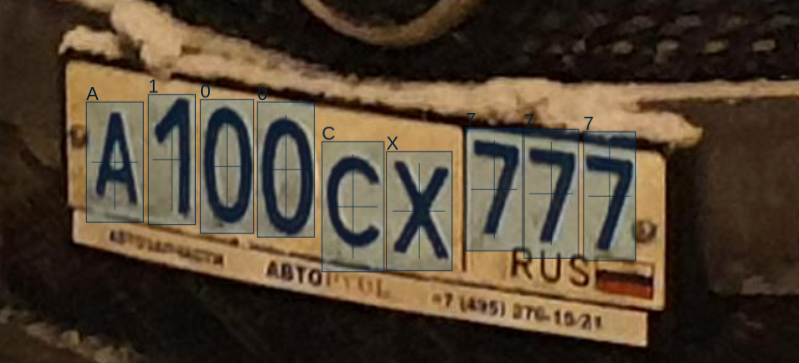
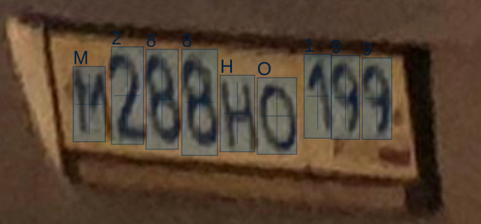

# License Plate Recognition with [go-darknet](https://github.com/LdDl/go-darknet) [](https://godoc.org/github.com/LdDl/license_plate_recognition) [](https://sourcegraph.com/github.com/LdDl/license_plate_recognition?badge) [](https://goreportcard.com/report/github.com/LdDl/license_plate_recognition) [](https://github.com/LdDl/license_plate_recognition/releases)

## Table of Contents

- [About](#about)
- [Requirements](#requirements)
- [Installation](#installation)
    - [Get source code](#get-source-code)
    - [Protobuf generation](#generate-protobuf-*.go-files-for-Go-server-and-Go-client)
    - [Neural net weights](#download-weights-and-configuration)
    - [Custom handler](#custom-handler)
- [Usage](#usage)
    - [Server](#start-server)
    - [Client](#test-client-server)


## About
This is a gRPC server which accepts image and can make license plate recognition (using YOLOv3 or YOLOv4 neural network).

Neural networks were trained on dataset of russian license plates. But you can train it on another dataset - read about process here https://github.com/AlexeyAB/darknet#how-to-train-to-detect-your-custom-objects

Server tries to find license plate at first. Then it does OCR (if it's possible) and provides output which can be represented later as follows:

Sample plate #1            |  Sample plate #2
:-------------------------:|:-------------------------:
  |  

<p style="text-align: center;"><i>Images has been taken near my house</i></p>

Darknet architecture for finding license plates - [Yolo V3](https://arxiv.org/abs/1804.02767)

Darknet architecture for doing OCR stuff - [Yolo V4](https://arxiv.org/abs/2004.10934)

gRPC server accepts this data struct according [proto3 specification](service/rpc/protos/object.proto)
```protobuf
// Essential information to process
message LPRRequest{
    // Bytes representation of image (PNG)
    bytes image = 1;
    // Optional information about image. Could be usefull if client-side already knows where license plate should be located (due some object detections technique)
    BBox bbox = 2;
}

// Reference information about detection rectangle
message BBox{
    int32 x_left = 1;
    int32 y_top = 2;
    int32 height = 3;
    int32 width = 4;
}
```

The gRPC server response is:
```protobuf
// Response from server
message LPRResponse{
    // Set of found license plates with corresponding information
    repeated LPRInfo license_plates = 1;
    // Number of seconds has taken to proccess license plate detections and OCR
    float elapsed = 2;
    // Optional message from server
    string message = 3;
    // Optional warning message from server. If it is not empty you probably should investiage such behavior
    string warning = 4;
    // Optional error message from server. If it is not empty you should investiage the error
    string error = 5;
}

// Information about single license plate
message LPRInfo {
    // License plate location
    BBox bbox = 1;
    // License plate OCR bounding bboxes. Bounding bboxes are sorted by horizontal line
    // Warning: those coordinates are relative to license plate bounding box, not the parent image!
    repeated BBox ocr_bboxes = 2;
    // License plate text
    string text = 3;
}
```

Full gRPC documentation is here: [HTML](service/rpc/docs/service.html) or [Markdown](service/rpc/docs/service.md)

## Requirements

$\textcolor{red}{\textsf{No OpenCV installation is needed!}}$ 

Please follow instructions from [go-darknet](https://github.com/LdDl/go-darknet#go-darknet-go-bindings-for-darknet). There you will know how to install [AlexeyAB's darknet](https://github.com/AlexeyAB/darknet) and [Go-binding](https://github.com/LdDl/go-darknet) for it.

## Instalation

### Get source code
**Notice: we are using Go-modules**
```shell
go get https://github.com/LdDl/license_plate_recognition
```

### Download weights and configuration
**Notice: please read [source code of *.sh script](cmd/download_data_RU.sh) before downloading. This script MAY NOT fit yours needs.**
```shell
cd cmd/
chmod +x download_data_RU.sh
./download_data_RU.sh
```


## Usage
### Start server
* Navigate to folder with server application source code
    ```shell
    cd cmd/server
    ```
* Build source code of server application to executable
    ```shell
    go build -o recognition_server main.go
    ```
* Run server application
    ```shell
    ./recognition_server --cfg conf.toml
    ```
    Note: Please see [conf.toml](cmd/server/conf.toml) description for correct usage

* On server's side the directory './detected' will appear if you provide `save_detected = true` in TOML configuration. Detected license plates with OCR annotations will be stored there.

### Test Client-Server
**Notice: server should be started**
* Navigate to folder with server application source code
    ```shell
    cd cmd/client
    ```
* Build source code of client application to executable
    ```shell
    go build -o client_app main.go
    ```
* Run client application
    ```shell
    ./client_app --host=localhost --port=50051 --file=sample.jpg -x 0 -y 0 --width=4032 --height=3024
    ```

* Check, if server can handle error (like negative _height_ parameter):
    ```shell
    ./client_app --host=localhost --port=50051 --file=sample.jpg -x 0 -y 0 --width=42 --height=-24
    ```

* On client's side there will be output something like this:
    ```shell
    Elapsed seconds: 0.17216872
    Detections num: 2
    Detection #0:
            Text: A100CX777
            Plate bbox: x_left:2027 y_top:2027 height:304 width:646
            OCR bboxes: [x_left:109 y_top:109 height:71 width:71 x_left:186 y_top:186 height:77 width:59 x_left:252 y_top:252 height:79 width:66 x_left:323 y_top:323 height:80 width:73 x_left:404 y_top:404 height:77 width:77 x_left:485 y_top:485 height:70 width:83 x_left:584 y_top:584 height:72 width:71 x_left:657 y_top:657 height:76 width:68 x_left:731 y_top:731 height:76 width:66]
    Detection #1:
            Text: M288HO199
            Plate bbox: x_left:262 y_top:262 height:186 width:391
            OCR bboxes: [x_left:56 y_top:56 height:28 width:25 x_left:86 y_top:86 height:36 width:24 x_left:112 y_top:112 height:36 width:25 x_left:139 y_top:139 height:39 width:27 x_left:168 y_top:168 height:28 width:27 x_left:196 y_top:196 height:28 width:31 x_left:232 y_top:232 height:30 width:21 x_left:253 y_top:253 height:31 width:21 x_left:276 y_top:276 height:30 width:23]
    ```
